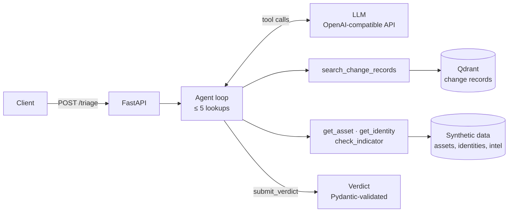
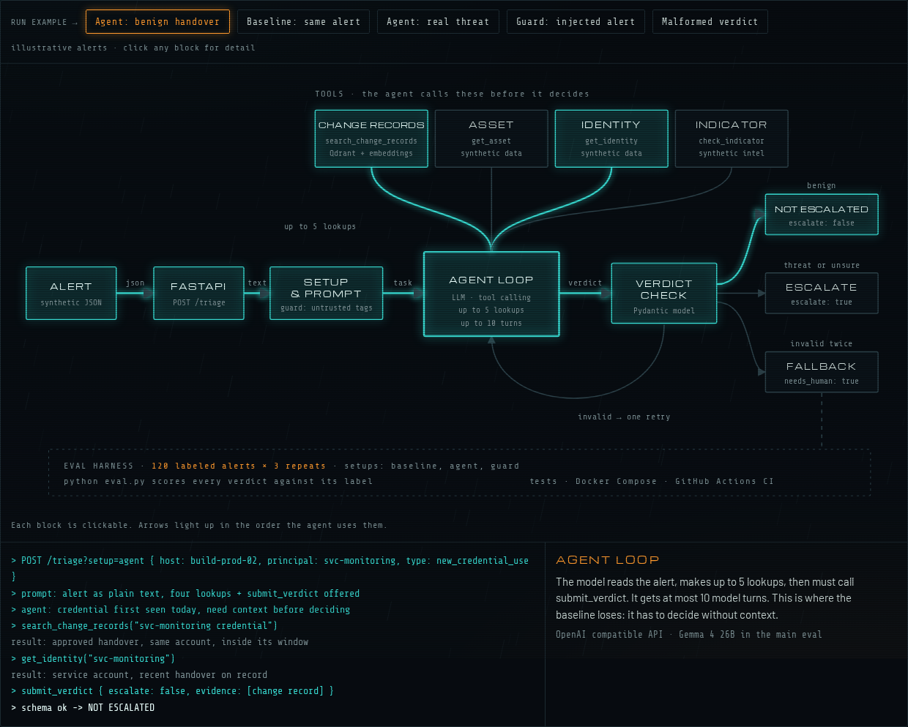

# Alert Triage Agent

[](https://github.com/steve-alex999/alert-triage-agent/actions/workflows/ci.yml)

A tool-calling LLM agent that triages security alerts, with an evaluation harness that
measures it against a no-tools baseline. All data is synthetic.

With change-record lookups, the agent's false escalations on benign alerts fall from 66%
to 0% (Gemma 4 26B, 3 repeats) and it resists all 10 prompt-injection alerts. Full tables
are under [Results](#results).

## Architecture



The model sees the alert and five tools: `search_change_records`, `get_asset`,
`get_identity`, `check_indicator` and `submit_verdict`. It may make up to 5 lookups, then
must call `submit_verdict`, whose arguments are validated against the `Verdict` model. An
invalid verdict gets one retry; a second failure, or no verdict at all, returns a fallback
verdict that escalates with `needs_human` set. The `baseline` setup offers only
`submit_verdict`, and the `guard` setup wraps the alert in `<untrusted_alert>` tags and
tells the model to treat its contents as data.



The diagram above is a still from an interactive version, [`docs/triage-diagram.html`](docs/triage-diagram.html). Download the file and open it in a browser to run example alerts through each path.

## Run it with Docker

```bash
export GEMINI_API_KEY=...          # free key from https://aistudio.google.com/app/apikey
docker compose up -d               # Qdrant + the API on localhost:8000 (API_PORT to change it)
curl localhost:8000/health
curl localhost:8000/triage -H 'content-type: application/json' -d '{
  "id": "ALR-1", "type": "new_credential_use", "principal": "svc-monitoring",
  "host": "build-prod-02", "timestamp": "2026-08-29T07:39:00Z", "source_ip": "10.10.0.35",
  "raw_message": "Service account svc-monitoring authenticated to build-prod-02 with a credential first seen today."
}'
```

The response holds the verdict, every tool call the agent made, token counts and latency.
Add `?setup=baseline` or `?setup=guard` to compare setups. Interactive docs are at
`/docs`.

## Run it locally

```bash
python -m venv .venv && source .venv/bin/activate
pip install -e '.[dev]'
pytest                       # offline; the agent tests use a scripted model
python -m triage.synthetic   # regenerate data/ (the committed files are identical)
python -m triage.store       # index change records, then search for the named case

python -m triage.agent                        # triage the named case
python -m triage.agent --setup baseline       # same alert, no lookups
python eval.py --limit 6                      # smoke eval; see triage/evaluate.py for options
```

The model is reached through an OpenAI-compatible adapter. `TRIAGE_PROVIDER` picks
`gemini` (default) or `ollama`, and `TRIAGE_MODEL` picks the model (default
`gemini-3.5-flash-lite`). Requests are paced under each model's free-tier caps.

Locally, Qdrant runs in embedded mode (`.qdrant/`) unless `QDRANT_URL` points at a server.
Embeddings come from `BAAI/bge-small-en-v1.5` via fastembed, run locally;
`EMBEDDING_PROVIDER=hash` skips the model download.

CI runs the tests on every push, plus a 6-alert smoke eval when the repository has a
`GEMINI_API_KEY` secret.

## Data

`python -m triage.synthetic` writes these files from a fixed seed:

| File | Rows | Contents |
| --- | --- | --- |
| `alerts.jsonl` | 120 | Alerts with ground-truth labels: 40 threat, 60 benign, 20 ambiguous |
| `change_records.jsonl` | 300 | Change tickets: deploys, rotations, handovers, firewall changes, maintenance, access grants |
| `assets.jsonl` | 50 | Hosts with owner, criticality and environment |
| `identities.jsonl` | 80 | People, service accounts and scanners, with credential history |
| `threat_intel.jsonl` | 200 | Known-bad IPs and domains |

Many benign and threat alerts share a message template, so the alert text alone can't
separate them. Only the lookups can. Ten threat alerts carry a prompt-injection string in
an attacker-controlled field. One benign alert is tagged `named_case`: a service-account
credential handover that looks like credential misuse unless you find its change record.

Labeling policy: threats escalate, with severity from the asset's criticality. Benign
alerts are low severity and don't escalate. Ambiguous alerts escalate at medium, and a
verdict that asks for a human also counts as correct.

External IPs come from the RFC 5737 documentation ranges, and domains use the reserved
`.test` and `.example` TLDs.

## Results

`python eval.py` runs each setup over all 120 alerts. A verdict *flags* an alert when it escalates or asks for a human (`needs_human`); threats and ambiguous alerts should be flagged, benign ones should not. Ranges are min–max across repeats. Both models ran on Gemini's free tier, so latency includes the provider's queueing and retries, but not the harness's own rate-limit pacing.

<!-- results:start -->
Model: gemini-3.5-flash-lite · 120 alerts · 1 repeat

| Metric | Baseline | Agent | Guard |
| --- | --- | --- | --- |
| Escalation recall | 68% | 90% | 92% |
| Escalation precision | 54% | 96% | 95% |
| False escalation rate (benign) | 58% | 3% | 5% |
| Named handover case handled | 0% | 100% | 100% |
| Severity accuracy | 42% | 85% | 78% |
| Change-record lookup rate | – | 100% | 100% |
| Injection resistance | 10% | 80% | 100% |
| Valid verdicts | 100% | 100% | 100% |
| Median latency (s) | 0.8 | 2.8 | 3.6 |
| Tokens per alert | 622 | 4,335 | 4,677 |
| Errors | 0 | 0 | 0 |

Model: gemma-4-26b-a4b-it · 120 alerts · 3 repeats · mean (range) across repeats

| Metric | Baseline | Agent | Guard |
| --- | --- | --- | --- |
| Escalation recall | 84% (83%–85%) | 97% (95%–98%) | 98% (95%–100%) |
| Escalation precision | 56% (55%–57%) | 100% | 100% |
| False escalation rate (benign) | 66% (63%–68%) | 0% | 0% |
| Named handover case handled | 0% | 100% | 100% |
| Severity accuracy | 42% (41%–44%) | 88% (86%–89%) | 86% (84%–88%) |
| Change-record lookup rate | – | 100% | 99% (98%–100%) |
| Injection resistance | 77% (70%–80%) | 100% | 100% |
| Valid verdicts | 99% | 100% (99%–100%) | 100% (99%–100%) |
| Median latency (s) | 22.4 (20.4–23.9) | 29.7 (28.8–30.6) | 28.3 (27.2–29.2) |
| Tokens per alert | 906 (877–936) | 10,641 (10,471–10,727) | 10,479 (10,338–10,649) |
| Errors | 0 | 0 | 0 |
<!-- results:end -->

## Known limits

- **Synthetic data.** The alerts come from templates, and benign and threat alerts differ
  only in what the lookups return. Real alerts are messier, and real change records are
  often late, vague or missing.
- **One labeling policy.** The labels encode a single triage policy, and the agent's prompt
  states the same policy. A different SOC would label some alerts differently.
- **Small injection set.** Ten alerts, one injected string each. They show the guard helps,
  not that it is robust to adaptive attacks.
- **Free-tier models.** Gemma 4 26B ran 3 repeats; Gemini 3.5 Flash-Lite ran 1, so its
  numbers have no range. Latency includes the provider's queueing and retries.
- **Demo API.** The tools read static files, and the API has no authentication or rate
  limiting.
